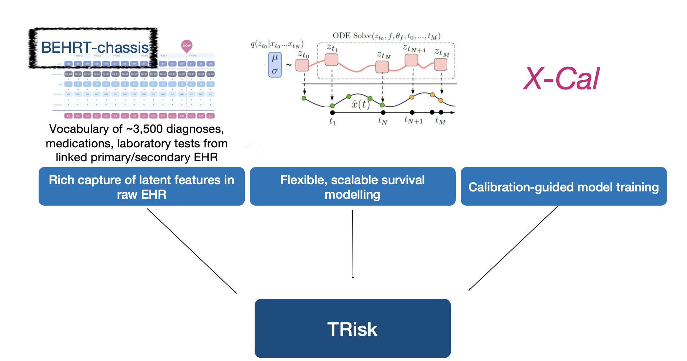

# TRisk
Repository for TRisk model 
Manuscripts (in preparation) associated:  
Refined selection of individuals for preventive cardiovascular disease treatment with a Transformer-based risk model 
Shishir Rao, Yikuan Li, Mohammad Mamouei, Gholamreza Salimi-Khorshidi, Malgorzata Wamil, Milad Nazarzadeh, Christopher Yau, Gary S Collins, Rod Jackson, Andrew Vickers, Goodarz Danaei, Kazem Rahimi.  

A Transformer-based survival model for point-of-care prediction of all-cause mortality in heart failure patients: a multi-cohort study 
Shishir Rao, Gholamreza Salimi-Khorshidi, Christopher Yau, Huimin Su, Nathalie Conrad, Mark Woodward, John GF Cleland, Kazem Rahimi 

How to use: 
In "Demo" folder, run the "demoTRisk.ipynb" file. A "forDemoTRisk2.parquet" file is provided to test/play and demonstrate how the vocabulary/year/age/etc function. The model has no pre-trained weights here but can fully run on the sampel (synthetic) cohort of 3000 patients. The files in the "ModelPkg" folder contain model and data handling packages in addition to other necessary relevant files and helper functions. 

Additionally, all diagnostic codes used to identify secondary outcomes in the UK validation study is provided in "DiagCodes" folder within the phenotyping document, "DiagCodes.docx".

Requirements: 
torch >1.6.0 
numpy 1.19.2 
sklearn 0.23.2 
pandas 1.1.3 
 
