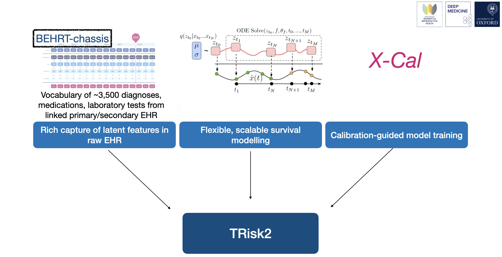

# TRisk2
Repository for TRisk2 model
Manuscript: TRisk2 – a Transformer-based survival model for prediction of clinical outcomes in patients with heart failure: a multi-cohort study 
Shishir Rao, Gholamreza Salimi-Khorshidi, Christopher Yau, Huimin Su, Nathalie Conrad, Mark Woodward, John GF Cleland, Kazem Rahimi

How to use: 
In "Demo" folder, run the "demoTRisk2.ipynb" file. A "forDemoTRisk2.parquet" file is provided to test/play and demonstrate how the vocabulary/year/age/etc function. The model has no pre-trained weights here but can fully run on the sampel (synthetic) cohort of 3000 patients. 

The files in the "ModelPkg" folder contain model and data handling packages in addition to other necessary relevant files and helper functions.

Requirements: 
torch >1.6.0 
numpy 1.19.2 
sklearn 0.23.2 
pandas 1.1.3 
 
